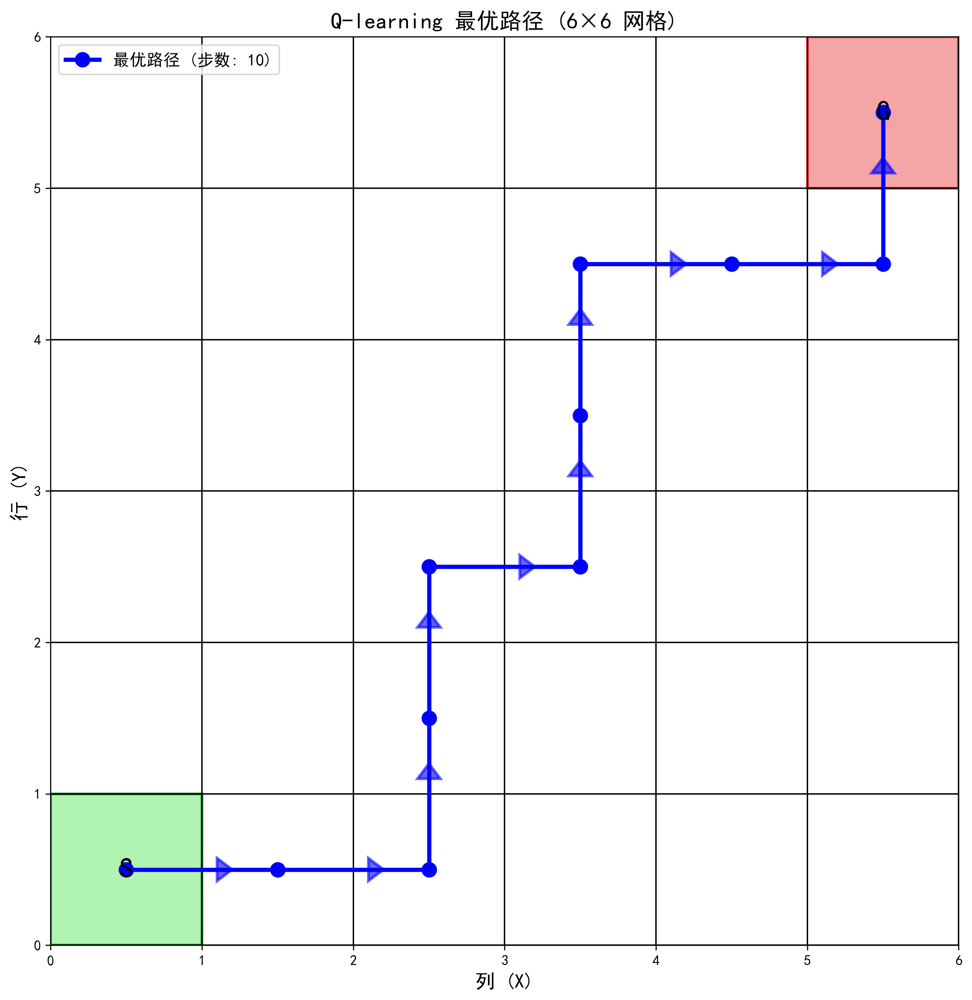
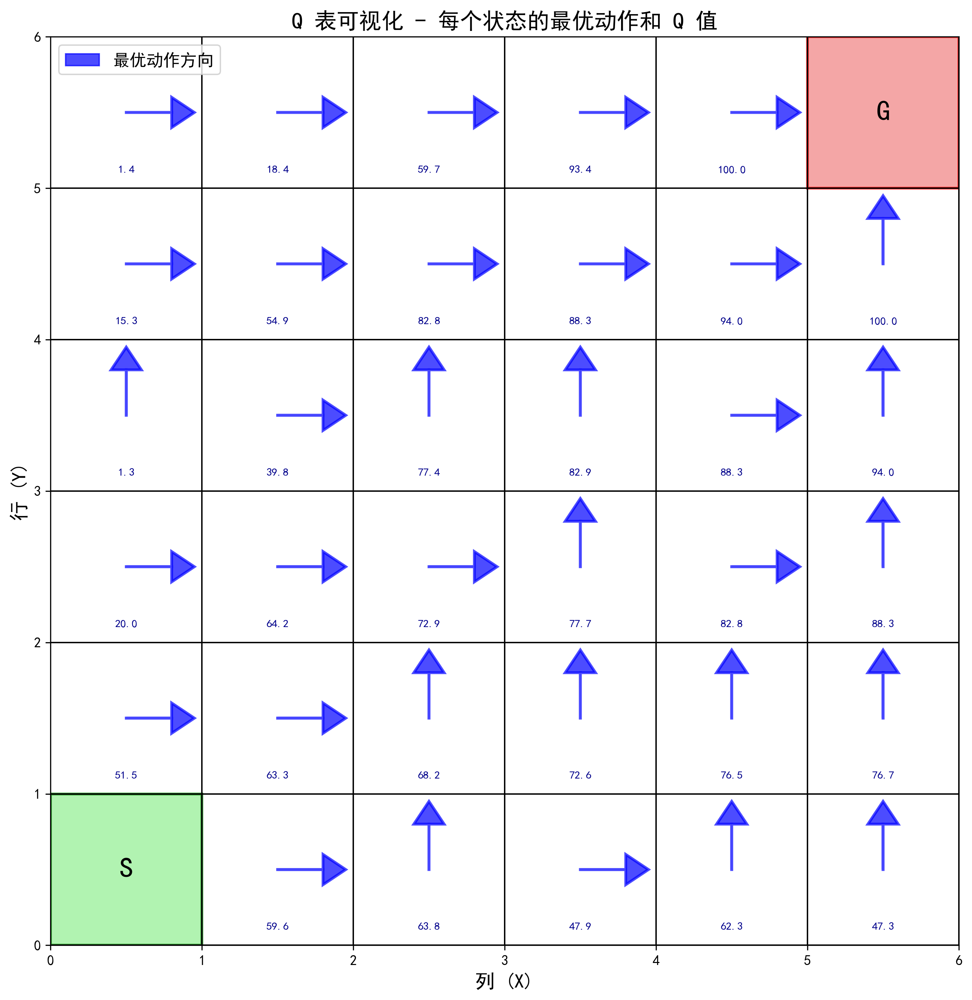

# 强化学习路径规划 Demo

## 项目简介

这是一个基于 Q-learning 算法的强化学习路径规划演示项目。智能体在 6×6 网格中学习从起点（左下角）到终点（右上角）的最优路径。

## 文件结构

```
rl/
├── grid_pathfinding_rl.py    # 主程序文件
├── 解释.md                    # 详细的原理和代码解释文档
├── README.md                  # 本文件
└── pic/                       # 可视化结果图片目录
    ├── optimal_path.png               # 最优路径图
    ├── training_process.png           # 训练过程图
    └── q_table_visualization.png      # Q表可视化图
```

## 快速开始

### 环境要求

```bash
python >= 3.7
numpy
matplotlib
```

### 安装依赖

```bash
pip install numpy matplotlib
```

### 运行程序

```bash
cd rl
python grid_pathfinding_rl.py
```

### 预期输出

程序运行后会：
1. 在控制台输出训练进度和统计信息
2. 在 `pic/` 目录下生成 3 张可视化图片
3. 显示找到的最优路径

## 结果解读

### 1. 最优路径图 (optimal_path.png)



- **绿色方块 (S)**: 起点位置
- **红色方块 (G)**: 终点位置
- **蓝色路径**: 智能体学习到的最优路径
- **箭头**: 表示移动方向

**结果分析**:
- 本次训练找到了 **10 步**的最优路径
- 这是从左下角到右上角的最短曼哈顿距离
- 路径高效且直接，没有绕路

### 2. 训练过程图 (training_process.png)

包含 4 个子图，展示完整的训练过程：

#### 左上：奖励变化
- 从初期的负值逐步上升到 90 左右
- 红色平滑曲线显示学习趋势明显
- 表明智能体成功学会了到达目标

#### 右上：步数变化
- 从初期的 60+ 步下降到稳定的 11 步
- 说明智能体找到了更高效的路径
- 越接近理论最优值（10 步）越好

#### 左下：探索率衰减
- 从 1.0 平滑衰减到 0.08
- 符合从探索到利用的学习规律

#### 右下：成功率变化
- 快速从 70% 上升到 100%
- 在 150 回合后稳定在 100%
- 表明策略已完全收敛

### 3. Q 表可视化 (q_table_visualization.png)



- **箭头方向**: 每个状态的最优动作
- **数字**: 对应的 Q 值
- **Q 值梯度**: 越靠近目标，Q 值越高（从 1.4 到 100.0）

**关键发现**:
- 所有箭头形成了指向终点的"势能场"
- Q 值呈现清晰的梯度分布
- 策略直观且符合最优路径规划

## 训练结果统计

根据本次运行结果：

| 指标 | 数值 |
|------|------|
| 最后 100 回合平均奖励 | 89.95 |
| 最后 100 回合平均步数 | 11.05 |
| 最后 100 回合成功率 | 100% |
| 最终探索率 (ε) | 0.082 |
| 最优路径步数 | 10 |

## 参数配置

当前配置（可在代码中修改）：

```python
learning_rate = 0.1        # 学习率
discount_factor = 0.95     # 折扣因子
epsilon = 1.0              # 初始探索率
epsilon_decay = 0.995      # 探索率衰减系数
epsilon_min = 0.01         # 最小探索率
n_episodes = 500           # 训练回合数
max_steps = 100            # 每回合最大步数
```

### 参数调优建议

- **学习速度慢**: 增加 `learning_rate` 到 0.2
- **路径不够优**: 提高 `discount_factor` 到 0.99
- **收敛不稳定**: 降低 `learning_rate` 到 0.05
- **需要更多训练**: 增加 `n_episodes` 到 1000

详细的参数说明请参考 [解释.md](解释.md#参数调优指南)

## 扩展实验

### 1. 修改网格大小

```python
env = GridWorld(size=10)  # 改为 10×10 网格
```

### 2. 添加障碍物

在 `GridWorld.__init__()` 中添加：
```python
self.obstacles = [(2, 2), (3, 3), (4, 4)]
```

在 `step()` 方法中添加障碍物检测逻辑。

### 3. 调整奖励函数

在 `step()` 方法中修改：
```python
if self.current_state == self.goal_state:
    reward = 200  # 增加目标奖励
```

### 4. 尝试不同的起点和终点

```python
self.start_state = (0, 0)  # 左上角
self.goal_state = (5, 5)   # 右下角
```

## 学习资源

想深入了解强化学习原理？请阅读 [解释.md](解释.md)，其中包含：

- ✅ 强化学习基础概念（状态、动作、奖励、策略）
- ✅ Q-learning 算法详解（更新公式、ε-贪婪策略）
- ✅ 逐行代码讲解
- ✅ 训练过程分析
- ✅ 参数调优指南
- ✅ 常见问题解答

## 常见问题

### Q: 为什么有时路径不是 10 步？

A: 可能原因：
1. 训练回合数不足（增加到 1000）
2. 陷入局部最优（多运行几次）
3. 探索率设置不当（调整 epsilon_decay）

### Q: 如何保存训练好的模型？

A: 可以使用 numpy 保存 Q 表：
```python
np.save('q_table.npy', agent.q_table)
```

加载时：
```python
agent.q_table = np.load('q_table.npy')
```

### Q: 能否用于实际 UAV 路径规划？

A: 本项目是教学演示。实际应用需要：
- 三维空间建模
- 连续状态空间（使用 DQN）
- 动态障碍物处理
- 更复杂的奖励函数

## 技术原理

### Q-learning 核心公式

```
Q(s,a) ← Q(s,a) + α[r + γ·max Q(s',a') - Q(s,a)]
```

其中：
- `Q(s,a)`: 状态 s 下采取动作 a 的价值
- `α`: 学习率（0.1）
- `r`: 即时奖励
- `γ`: 折扣因子（0.95）
- `s'`: 下一个状态

### ε-贪婪策略

```
以概率 ε: 随机探索
以概率 1-ε: 选择最优动作
```

平衡探索（发现新策略）与利用（使用已知最优策略）。

## 性能指标

在标准配置下的典型表现：

- **训练时间**: ~5 秒（500 回合）
- **内存占用**: < 10 MB
- **收敛速度**: 150-200 回合达到 100% 成功率
- **最终性能**: 100% 成功找到 10-11 步的最优路径

## 贡献与反馈

如有问题或建议，欢迎提出！

## 相关资源

- [强化学习经典教材](http://incompleteideas.net/book/the-book-2nd.html) - Sutton & Barto
- [OpenAI Gym](https://gym.openai.com/) - 强化学习环境库
- [Stable Baselines3](https://stable-baselines3.readthedocs.io/) - 高质量 RL 算法实现

---

**Happy Learning! 🚀**
